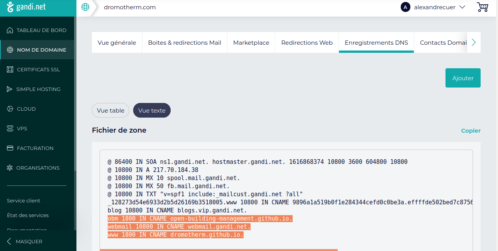

# gérer ses noms de domaine



On a autant de champs CNAME qu'on a de sous-domaines

Ici, on a : 

- le domaine `www.dromotherm.com` avec la ligne `www 1800 IN CNAME dromotherm.github.io.`
- le sous-domaine `obm.dromotherm.com` avec la ligne `obm 1800 IN CNAME Open-Building-Management.github.io.`

A noter qu'on a toujours un `.` à la fin de `dromotherm.github.io.` ou de `Open-Building-Management.github.io.`

Il faut ensuite créer le fichier CNAME à la racine du site web, mais seulement quant on déploie depuis une branche.

Si on publie à partir d’un workflow GitHub Actions, tout fichier CNAME est ignoré et n’est pas requis.

On peut utiliser l'outil dig en ligne de commande pour vérifier que le sous domaine `obm.dromotherm.com` pointe bien vers les github pages.

```
dig obm.dromotherm.com +noall +answer -t A
obm.dromotherm.com.	1800	IN	CNAME	Open-Building-Management.github.io.
Open-Building-Management.github.io. 1433 IN A	185.199.111.153
Open-Building-Management.github.io. 1433 IN A	185.199.108.153
Open-Building-Management.github.io. 1433 IN A	185.199.109.153
Open-Building-Management.github.io. 1433 IN A	185.199.110.153
```
# dynamic dns

check the external ip from the local machine

https://github.com/begleysm/ipwatch/

## listes de sites permettant de faire du check de dns

- http://ip.dnsexit.com
- http://ifconfig.me/ip
- https://ipecho.net/plain
- http://checkip.dyndns.org/plain
- https://www.ipanywhere.com/
- https://www.my-ip-address.co/
- https://myexternalip.com/raw
- https://canyouseeme.org/
- http://www.trackip.net/
- http://icanhazip.com/
- https://www.ipchicken.com/
- http://whatsmyip.net/
- http://www.lawrencegoetz.com/programs/ipinfo/
- https://ip-lookup.net/
- http://ipgoat.com/
- http://www.myipnumber.com/my-ip-address.asp
- http://formyip.com/
- https://check.torproject.org/
- http://www.displaymyip.com/
- https://www.geodatatool.com/
- https://www.whatsmydns.net/whats-my-ip-address.html
- http://checkip.dyndns.com/
- http://www.ip-adress.eu/
- https://www.infosniper.net/
- https://wtfismyip.com/text
- http://httpbin.org/ip
- https://diagnostic.opendns.com/myip
- http://checkip.amazonaws.com
- https://api.ipify.org
https://v4.ident.me
