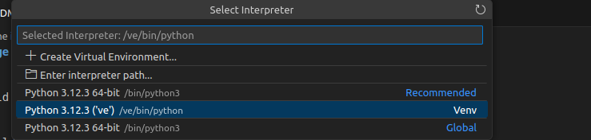

# build the image

```
sudo docker build -t torch_ubuntu .
```

then open the folder in vscode and rebuild in container with CTRL+SHIFT+P

select the appropriate interpreter again with CTRL+SHIFT+P and enter `interpreter` in the command palette, so that pylance can find all venv modules



# download the model

```
ollama pull deepseek-r1:1.5b
```

```
ollama run deepseek-r1:1.5b "tu parles français ?"
ollama run deepseek-r1:1.5b "factorise l'équation 3x^2 + 5x - 2"
```


