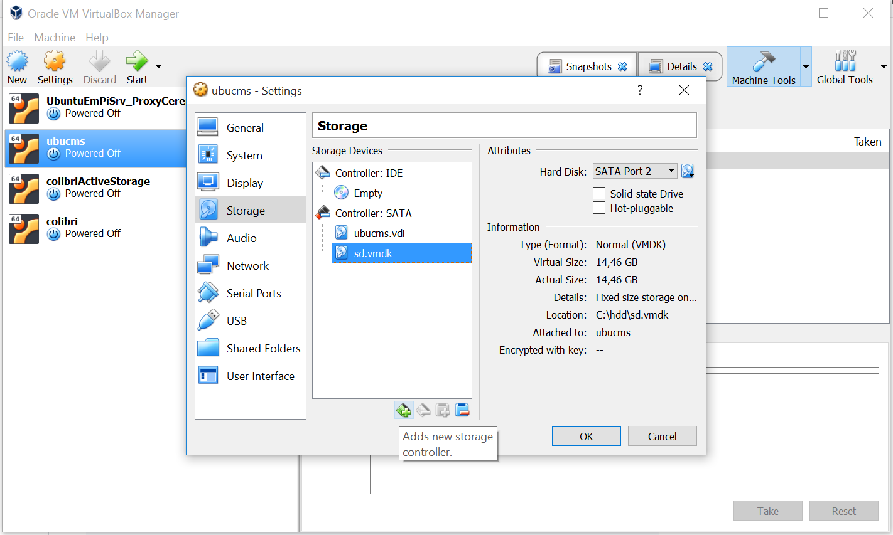

## preparation

we assume you use Oracle VM VirtalBox for virtualization

burn a rasbian stretch lite image on the SD using Etcher

you may want to start enabling SSH from windows, as /boot is accessible from the explorer

assuming the SD has been mouted on the unit E

`
echo.>E:\ssh
`

another option is to do it later on the VM using a touch command

in a windows DOS shell, run the folowing command to identify your SD card
```
wmic diskdrive list brief
```
the output should be like the following :
```
C:\Users\alexandre.cuer>wmic diskdrive list brief
Caption                            DeviceID            Model                              Partitions  Size
Generic STORAGE DEVICE USB Device  \\.\PHYSICALDRIVE1  Generic STORAGE DEVICE USB Device  2           15521103360
HFS256G32MND-2200A                 \\.\PHYSICALDRIVE0  HFS256G32MND-2200A                 3           256052966400
```

`\\.\PHYSICALDRIVE1` is your sd card

`\\.\PHYSICALDRIVE0` is your windows hdd

create a directory C:\hdd

Running a DOS shell as an admin, create a vmdk file :
```
"C:\Program Files\Oracle\VirtualBox\VBoxManage" internalcommands createrawvmdk -filename "c:/hdd/sd.vmdk" -rawdisk "\\.\PHYSICALDRIVE1"
```

then :
- run Oracle VM VirtualBox as an admin
- on the machine you want to run, click on Settings>storage
- on SATA controller, add a new hard disk > choose existing hdd and point to the sd.vmdk file you've created



Boot the VM and search for the device corresponding to the sd with fdisk :

```
sudo fdisk -l
```
find something like that within the output :
```
Disk /dev/sdc: 14,5 GiB, 15523119104 bytes, 30318592 sectors
Units: sectors of 1 * 512 = 512 bytes
Sector size (logical/physical): 512 bytes / 512 bytes
I/O size (minimum/optimal): 512 bytes / 512 bytes
Disklabel type: dos
Disk identifier: 0xc1dc39e5

Device     Boot Start     End Sectors  Size Id Type
/dev/sdc1        8192   96042   87851 42,9M  c W95 FAT32 (LBA)
/dev/sdc2       98304 3522559 3424256  1,6G 83 Linux
```

this indicates that the burnt raspbian can be found on /dev/sdc2

```
cd /
sudo mkdir sdcard

sudo mount /dev/sdc2 /sdcard

wget https://raw.githubusercontent.com/openenergymonitor/EmonScripts/master/install/init_resize.sh
chmod +x init_resize.sh

sudo mv /sdcard/usr/lib/raspi-config/init_resize.sh /sdcard/usr/lib/raspi-config/init_resize.old

sudo cp init_resize.sh /sdcard/usr/lib/raspi-config/init_resize.sh

sudo umount /dev/sdc2
```


## installation

plug the SD into the RPI, boot, then connect via SSH (user pi password raspberry)

Create a directory that will be a mount point for the rw data partition

```
sudo mkdir /var/opt/emoncms
sudo chown www-data /var/opt/emoncms
```
Use modified fstab
```
wget https://raw.githubusercontent.com/openenergymonitor/EmonScripts/master/defaults/etc/fstab
sudo cp fstab /etc/fstab
sudo reboot
```

Check if file system has been correctly done with `df -h` command

Create 2 directories  in /opt :
- openenergymonitor, for the scripts and emonhub sources
- emoncms, for symlinked modules (postprocess, sync) and for uploaded tar.gz archives when importing a backup

```
cd /opt
sudo mkdir emoncms
sudo chown pi:pi /opt/emoncms
sudo mkdir openenergymonitor
sudo chown pi:pi openenergymonitor
```

install git
```
sudo apt-get install git
```
install the scripts :
```
cd openenergymonitor
git clone -b master https://github.com/alexandrecuer/EmonScripts
cd EmonScripts
cd install
./main.sh
```


To check partitions types
 
`
sudo file -sL /dev/mmcblk0p*
`
 
or
 
`
lsblk  -f
`

change user `pi` password, using the command `passwd`
