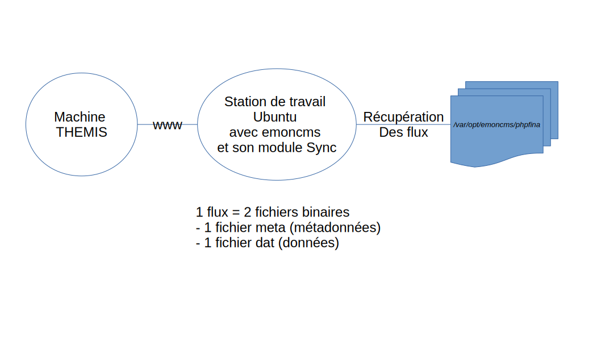

L'application web Emoncms est dans /var/www/emoncms

# services

Services de niveau I | emplacement sur PI
-- | --
emoncms_mqtt | /var/www/emoncms/scripts/services/emoncms_mqtt/emoncms_mqtt.php
feedwriter | /var/www/emoncms/scripts/feedwriter.php
service-runner | /var/www/emoncms/scripts/services/service-runner/service-runner.py

Services python de niveau II | code source sur github | emplacement sur PI
--|--|--
Emonhub, pour récupérer les données des matériels emonTx et emonPi | http://github.com/openenergymonitor/emonhub | /opt/openenergymonitor/emonhub
ota2, service over the air pour récupérer les données radio 169 Mhz Enless | https://github.com/alexjunk/BIOS2/blob/main/hardware/ota2.py | /opt/openenergymonitor/BIOS2/hardware
modbus, pour interroger un bus de terrain (promux, pyranomètres KippNzonen) | https://github.com/alexjunk/BIOS2/blob/main/hardware/modbus.py | /opt/openenergymonitor/BIOS2/hardware
bios, pour piloter des circuits de chaufferie + disposer en temps réel de la météo prévisionnelle sur les 7 prochains jours | https://github.com/alexjunk/BIOS2 | /opt/openenergymonitor/BIOS2

Documentation ota2, modbusTCP : https://github.com/alexjunk/BIOS2/tree/master/hardware

On y trouve le positionnement des jumpers pour le récepteur enless en mode USB

Les log sont dans /var/log et les services sont de type systemd. 
Pour plus détails, cf https://github.com/openenergymonitor/EmonScripts/blob/master/EmonPiFileSystem.md#emoncms-systemd-services

# modules UX

Les modules UX sont dans /var/www/emoncms/Modules

module OBMmonitor qui monitore n'importe quel service associé pourvu qu'il soit déclaré : http://github.com/alexjunk/OBMmonitor

module helloWorld : http://github.com/dromotherm/dromotherm

# récupération des données à distance
la solution 1 est de passer par le module de synchro :

la solution 2 est de faire un backup avec le module de backup et de le décompacter

pour exploiter avec python et numpy :

```
python3 -m pip install PyFina
```

cf https://pypi.org/project/PyFina/
