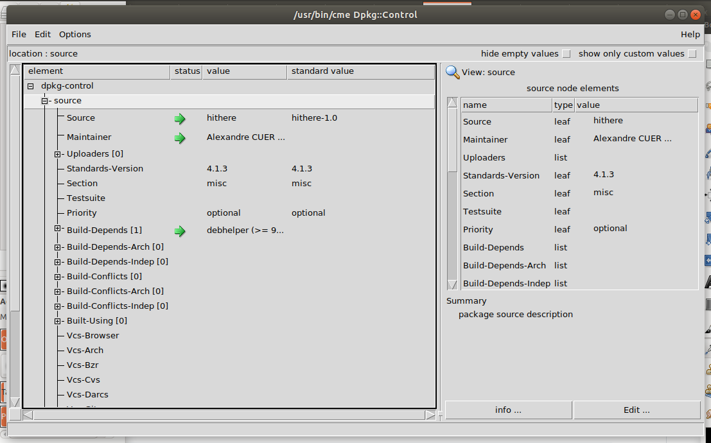

# how to create debian package ?

cf https://wiki.debian.org/Packaging/Intro?action=show&redirect=IntroDebianPackaging

install the tools
```
sudo apt-get install devscripts
sudo apt-get install -y debhelper
sudo apt-get install build-essential
sudo apt-get install cme libconfig-model-dpkg-perl libconfig-model-tkui-perl
```
une fois devscripts installés, on peut utiliser `debcheckout` et `dch`

# upstream tarball, from the developer team

`hithere-1.0.tar.gz` = upstream tarball

```
mv hithere-1.0.tar.gz hithere_1.0.orig.tar.gz
tar xf hithere_1.0.orig.tar.gz
cd hithere-1.0
mkdir debian
```
# debian/changelog
```
dch --create -v 1.0-1 --package hithere
```
The -1 part is the Debian version: the first version of the Debian package of upstream version 1.0.

once prompted, you have to fix the details of the `debian/changelog` file to your needs
```
hithere (1.0-1) UNRELEASED; urgency=low   

  * Initial release. (Closes: #XXXXXX)

 -- Alexandre CUER <alexandrecuer@wanadoo.fr>  Tue, 21 Jul 2020 10:19:42 +0200
```
# debian/compat
```
touch debian/compat
echo "9" > debian/compat
```
# debian/control

```
nano debian/control
```
here we only have one package (with the name hithere), so the control file should be like that :

```
Source: hithere
Maintainer: Alexandre CUER <alexandre.cuer@wanadoo.fr>
Section: misc
Priority: optional
Standards-Version: 4.1.3
Build-Depends: debhelper (>= 9)

Package: hithere
Architecture: any
Depends: ${shlibs:Depends}, ${misc:Depends}
Description: greet user
 hithere greets the user, or the world.
```
Section can be electronics, when building libraries dealing with the real world

Priority in general is 'optional' unless it's 'essential' for a standard functioning system, i.e., booting or networking functionality

Architecture is any if the package can be built for any architecture. In other words, the code has been written portably
if only on raspberry, can use armhf

the cme tool can be used to edit the debian/control file

```
cme edit dpkg-control
```


# debian/rules
```
nano debian/rules
```

the simpliest form consists to entrust everything to the dh command of debhelper
```
#!/usr/bin/make -f
%:
        dh $@

override_dh_auto_install:
        $(MAKE) DESTDIR=$$(pwd)/debian/hithere prefix=/usr install
```
**Lines 3 and 5 (last one) should be indented by one TAB character, not by 8 spaces.** 

The file is a makefile, and TAB is what the make command wants !!

# debian/source/format

```
mkdir debian/source
nano debian/source/format
```
it should contain the version number for the format of the source package, which is "3.0 (quilt)"

# debian/hithere.dirs
```
nano debian/hithere.dirs
```
the content should be :

```
usr/bin
usr/share/man/man1
```
