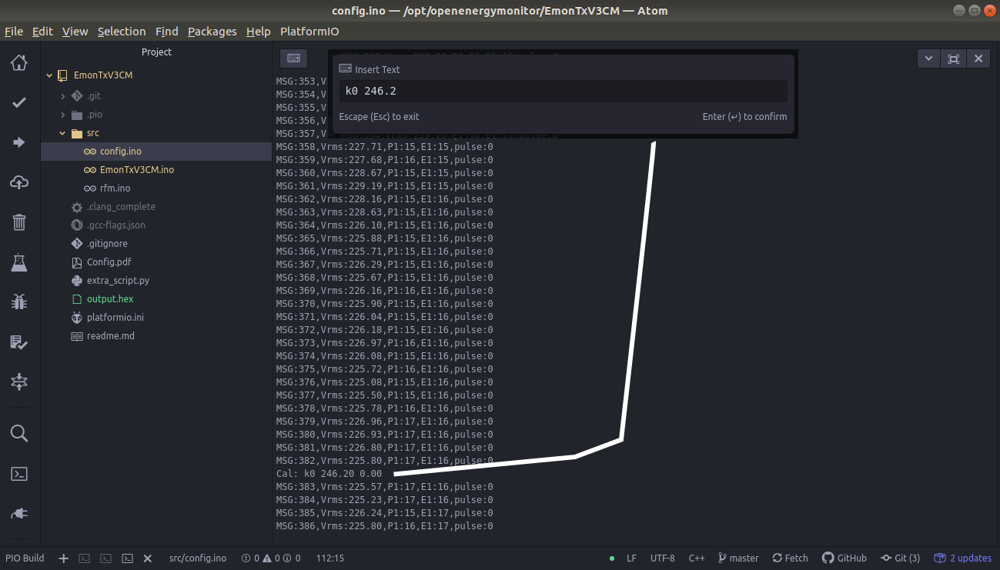
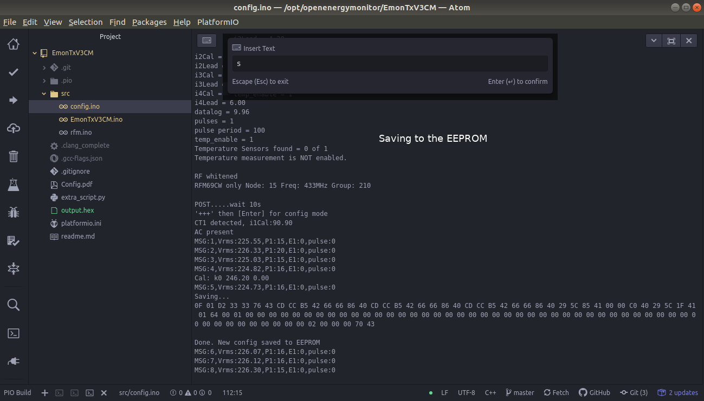

See : https://guide.openenergymonitor.org/technical/compiling/

And : https://github.com/openenergymonitor/emonpi/tree/master/firmware

# EmonTxV3CM plus PlatformIO within Atom on a ubuntu 18.04 machine

## the bad way : 

goal : insert new calibration values

- modify the config.ino with my Vcal value > line 112 `vCal         = 246.18;//data.vCal;`
- lauch a platformIO terminal
- run `pio run -t upload`, which creates a .pio/build/emontx directory with a firmware.hex file and upload the firmware
- reboot the emonTx

To manually upload firmware.hex on the emonTx :
```
cd .pio/build/emontx
avrdude -v -c arduino -p ATMEGA32 8P -P /dev/ttyUSB0 -b 115200 -U flash:w:firmware.hex
```
## the good way

do not modify the config.ino

keep `vCal         = data.vCal;`

Use the trick to calibrate during the measurement process itself with the command : `k0 246.2`

This is very convenient both with PlatformIO and with the arduino IDE



type `l` during the measurement if you want to check the settings

what is missing is how to calibrate in intensity.
First you have to modify the firmware in order to track current values
