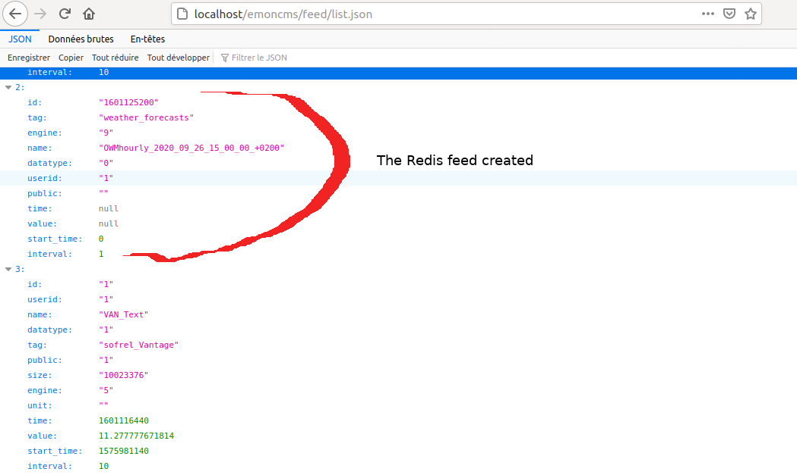
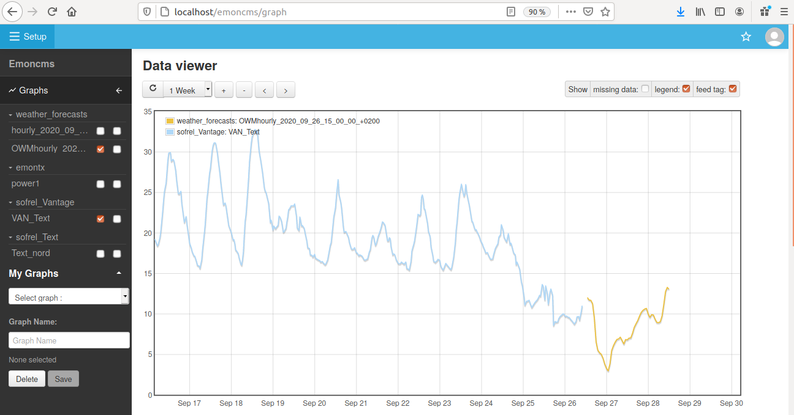

# Empower EmonCMS with Redis storage of forecasting datas coming from various API

There is really no point in storing weather forecasts on disk. But it can be nice to compare them to the field truth in order to choose the most suitable forecasting API. The ultimate goal is to run physical/statistical models on these forecasts to predict the evolution of the indoor temperature in a building. 

Of course, you can do this in python, using numpy arrays which are much used in the datascience world. Numpy arrays are easily storable in Redis in a binary form. But you have to collect the datas. As far as data collection is concerned, EmonCMS is really a must have. EmonCMS is strongly interfaced to a Redis database, used as a collecting buffer to reduce disk writing operations and also to store feeds metadatas.

My feeling is that it should be easy to send data batches as numpy array in Redis and to display them in EmonCMS, using the graph module and others visualization tools...

All we have to do is to write some minimalistic pieces of code in PHP and python :-) and also to have a good understanding of the EmonCMS architecture.

EmonCMS feeds are stored in Redis under the `feed` key

To create a new temporary feed (no existence on disk neither in the mariadb database) :
1) choose a quite big `int`, which will be the feed id : the starting timestamp of your feed can be a good choice, because it is very unlikely that you already created more streams than the timestamp number :-)
2) create a redis hash with the essential metadatas : datatype, engine, name, id, userid and public which can be blank. We can also add a tag for classification in emonCMS.
3) add the feed id to the user feed list which is stored in redis as a set
4) inject the data as binary in a string buffer

The numpy array should be constructed with axis 0 as time :
- column 0 is timestamp expressed in seconds
- column 1 to 3 are datas

In the following code sample, column 1 is nebulosity in %, column 2 is predicted outdoor temperature and column 3 temperature as felt by a human perception
```
import numpy as np
data = np.array(
[[ 1.6011252e+09,  7.5000000e+01,  1.2000000e+01,  6.3500000e+00],
 [ 1.6011288e+09,  5.3000000e+01,  1.1700000e+01,  6.3900000e+00],
 [ 1.6011324e+09,  3.2000000e+01,  1.1660000e+01,  6.7200000e+00],
 [ 1.6011360e+09,  2.0000000e+01,  1.1250000e+01,  7.1200000e+00],
 [ 1.6011396e+09,  1.3000000e+01,  9.4700000e+00,  6.3200000e+00],
 [ 1.6011432e+09,  1.1000000e+01,  6.5800000e+00,  3.4400000e+00],
 [ 1.6011468e+09,  0.0000000e+00,  5.5100000e+00,  2.4800000e+00],
 [ 1.6011504e+09,  0.0000000e+00,  5.2000000e+00,  1.9900000e+00],
 [ 1.6011540e+09,  1.0000000e+00,  5.0000000e+00,  1.6500000e+00],
 [ 1.6011576e+09,  7.0000000e+00,  4.5300000e+00,  1.2200000e+00],
 [ 1.6011612e+09,  7.0000000e+00,  3.8000000e+00,  3.3000000e-01],
 [ 1.6011648e+09,  9.0000000e+00,  3.2800000e+00, -1.7000000e-01],
 [ 1.6011684e+09,  2.4000000e+01,  2.9500000e+00, -4.7000000e-01],
 [ 1.6011720e+09,  6.2000000e+01,  3.8100000e+00,  2.2000000e-01],
 [ 1.6011756e+09,  7.5000000e+01,  5.4600000e+00,  2.1400000e+00],
 [ 1.6011792e+09,  8.1000000e+01,  6.0500000e+00,  2.4800000e+00],
 [ 1.6011828e+09,  8.5000000e+01,  6.4900000e+00,  2.3900000e+00],
 [ 1.6011864e+09,  8.7000000e+01,  6.8300000e+00,  2.4200000e+00],
 [ 1.6011900e+09,  1.0000000e+02,  6.9000000e+00,  2.0100000e+00],
 [ 1.6011936e+09,  1.0000000e+02,  7.1100000e+00,  1.9300000e+00],
 [ 1.6011972e+09,  1.0000000e+02,  6.6900000e+00,  1.2800000e+00],
 [ 1.6012008e+09,  1.0000000e+02,  6.2700000e+00,  9.2000000e-01],
 [ 1.6012044e+09,  1.0000000e+02,  6.8100000e+00,  1.2600000e+00],
 [ 1.6012080e+09,  1.0000000e+02,  6.7900000e+00,  1.1100000e+00],
 [ 1.6012116e+09,  1.0000000e+02,  6.9900000e+00,  1.2700000e+00],
 [ 1.6012152e+09,  1.0000000e+02,  7.0200000e+00,  2.0200000e+00],
 [ 1.6012188e+09,  1.0000000e+02,  7.5900000e+00,  1.9900000e+00],
 [ 1.6012224e+09,  1.0000000e+02,  8.3300000e+00,  2.9300000e+00],
 [ 1.6012260e+09,  1.0000000e+02,  8.7600000e+00,  3.6100000e+00],
 [ 1.6012296e+09,  1.0000000e+02,  9.1600000e+00,  3.9900000e+00],
 [ 1.6012332e+09,  1.0000000e+02,  9.6900000e+00,  5.1800000e+00],
 [ 1.6012368e+09,  1.0000000e+02,  1.0160000e+01,  6.1200000e+00],
 [ 1.6012404e+09,  1.0000000e+02,  1.0420000e+01,  7.3700000e+00],
 [ 1.6012440e+09,  1.0000000e+02,  1.0580000e+01,  7.7700000e+00],
 [ 1.6012476e+09,  1.0000000e+02,  1.0660000e+01,  7.5500000e+00],
 [ 1.6012512e+09,  1.0000000e+02,  1.0000000e+01,  6.4600000e+00],
 [ 1.6012548e+09,  4.9000000e+01,  9.5600000e+00,  6.4100000e+00],
 [ 1.6012584e+09,  7.3000000e+01,  9.8900000e+00,  7.0700000e+00],
 [ 1.6012620e+09,  8.1000000e+01,  9.8500000e+00,  7.2700000e+00],
 [ 1.6012656e+09,  8.3000000e+01,  9.3300000e+00,  6.9800000e+00],
 [ 1.6012692e+09,  8.4000000e+01,  8.9300000e+00,  6.9500000e+00],
 [ 1.6012728e+09,  8.6000000e+01,  8.9000000e+00,  7.1500000e+00],
 [ 1.6012764e+09,  9.8000000e+01,  9.0200000e+00,  7.4000000e+00],
 [ 1.6012800e+09,  9.8000000e+01,  9.7300000e+00,  8.0700000e+00],
 [ 1.6012836e+09,  9.6000000e+01,  1.1150000e+01,  9.3700000e+00],
 [ 1.6012872e+09,  8.9000000e+01,  1.2740000e+01,  1.0520000e+01],
 [ 1.6012908e+09,  8.6000000e+01,  1.3250000e+01,  1.0720000e+01],
 [ 1.6012944e+09,  8.8000000e+01,  1.3040000e+01,  1.1010000e+01]])
```
Running the toRedis method, and the feed is available in EmonCMS 

```
import struct
import redis
from datetime import datetime
from dateutil import tz

LOCTZ = tz.gettz('Europe/Paris')

r = redis.Redis(host="localhost", port=6379, db=0)

def tsToHuman(ts, fmt="%Y-%m-%d %H:%M:%S:%z", tz=LOCTZ):
    """
    format a timestamp to something readable by a human
    """
    return datetime.fromtimestamp(ts, tz).strftime(fmt)

def toRedis(data,feedname):
    """
    data injection in Redis for operation within EmonCMS
    """
    h,w = data.shape

    if h==0 or w==0 : return

    shape = struct.pack('>II',h,w)
    # cf https://numpy.org/doc/stable/reference/generated/numpy.ndarray.tobytes.html
    encoded = shape+data.tobytes()

    # starting timestamp will be the feed number
    ts=int(data[0,0])

    # data injection in node buffer
    buffer = "feed:{}:buffer".format(ts)
    r.set(buffer,encoded)

    # all this will work for emoncms user 1 only
    userid=1
    if r.exists(buffer):
        # node creation with metadatas
        tag = "weather_forecasts"
        name = "{}_{}".format(feedname,tsToHuman(ts,fmt="%Y_%m_%d_%H_%M_%S_%z"))
        feed = {"id":ts, "tag":tag, "engine":9, "name":name, "datatype":0, "userid":userid, "public":""}
        node = "feed:{}".format(ts)
        r.hmset(node, feed)
    else: return

    if r.exists(node):
        # feednumber injection in the user feeds list
        key = "user:feeds:{}".format(userid).encode()
        values = r.smembers(key)
        newval = "{}".format(ts).encode()
        if newval in values:
            self._log.info("user already owns the feed {}".format(ts))
        else:
            r.sadd(key,newval)

toRedis(data,"OWMhourly")
```
Just run the feed/list.json route to check that the feed is recognized



But the feed/data.json?id=1601125200 is not yet working

To make it work, we have to modify 3 files in the emonCMS source code :
- Modules/feed/feed_controller.php
- Modules/feed/engine/RedisBuffer.php
- Modules/feed/feed_model.php

In the generic model, we define a basic get_batch method, just after the get_data one :
```
    /*
    operate data batches injected to Redis buffer
    */
    public function get_batch($feedid)
    {
        $feedid = (int) $feedid;
        $engine = $this->get_engine($feedid);
        if ($engine == Engine::REDISBUFFER) {
            $this->log->info("get_batch() $feedid");
            $bufferdata = $this->EngineClass(Engine::REDISBUFFER)->get_batch($feedid);
            return $bufferdata;
        } else return "get_batch only supported by redibuffer engine 9";
    }
```
In the RedisBuffer engine, we create the specific get_batch method, also just after the get_data one :
```
    /**
     * Return a data batch
     * before injection into redis, the batch has been flattened and converted to binary
     * bytes 0 to 3 = number of lines as a 32 bit unsigned long, big endian byte order
     * bytes 4 to 7 = number of columns as a 32 bit unsigned long, big endian byte order
     * bytes 8 to the end = the flattened batch stored as doubles
     * @param integer $feedid : The id of the feed
    */
    public function get_batch($feedid)
    {
        $test = $this->redis->get("feed:$feedid:buffer");
        # from the PHP doc
        # N - unsigned long (always 32 bit, big endian byte order)
        $nblines = unpack('N', $test)[1];
        $nbcols = unpack('N', $test, 4)[1];
        $this->log->info("batch array has got $nblines lines & $nbcols cols");
        # d - double (machine dependent size and representation)
        $tab = unpack('d*', $test,8);
        $len = count($tab);
        $data = array();
        if ($nblines > 0) {
            $j=0;
            while ($j<$len) {
                $row=array_slice($tab,$j,$nbcols);
                $time=$row[0]*1000;
                $data[]=array($time,$row[2]);
                $j+=4;
            }
        }
        return $data;
    }
```
Then, we have to modify the data routing in the controller, which starts at `if ($route->action=="data")`
As engine 9 is not used for any data visualisations, the job is easy, and nothing will be required in the frontoffice :
```
if ($feed->get($feedid)["engine"]==9){
    $results[$key]['data'] = $feed->get_batch($feedid);
} else
```


Last step is to make sure that the delete route is functional for our temporary feeds.

The delete method in RedisBuffer.php is :
```
    public function delete($feedid)
    {
        $this->redis->srem("feed:bufferactive",$feedid); // remove from feedlist
        $bkey="feed:$feedid:buffer";
        // remove buffer
        $this->redis->zRemRangeByRank($bkey, 0, -1);
    }
```
Our buffer is a string whereas the buffer used for writing to real-life feeds is a zset (sorted set). So, let's simple change the delete method to :
```
    public function delete($feedid)
    {
        $this->redis->srem("feed:bufferactive",$feedid); // remove from feedlist
        $bkey="feed:$feedid:buffer";
        // remove buffer
        if ($this->redis->type($bkey)==1){
            $this->redis->del($bkey);
        } else {
            $this->redis->zRemRangeByRank($bkey, 0, -1);
        }
    }
```

## datatype numbers defined in `lib/enum.php`

number|datatype
--|--
0|undefined
1|realtime
2|daily
3|histogram

## engine numbers defined in `lib/enum.php`

number|engine
--|--
0|MYSQL
1|TIMESTORE = Depreciated
2|PHPTIMESERIES
3|GRAPHITE = Not included in core
4|PHPTIMESTORE = Depreciated
5|PHPFINA
6|PHPFIWA
7|VIRTUALFEED = Virtual feed, on demand post processing
8|MYSQLMEMORY = Mysql with MEMORY tables on RAM. All data is lost on shutdown
9|REDISBUFFER = (internal use only) Redis Read/Write buffer, for low write mode
10|CASSANDRA = Cassandra

## redis keys
Redis can manage various keys : string, hash, zset, list and set. Depending on the key type, you have to use a specific method to retrieve the values : get for string, hgetall for hash, zrange for zset, lrange for list and smembers for set.
```
keys = redis.keys('*')
for key in keys:
    type = redis.type(key)
    if type == "string":
        val = redis.get(key)
    if type == "hash":
        vals = redis.hgetall(key)
    if type == "zset":
        vals = redis.zrange(key, 0, -1)
    if type == "list":
        vals = redis.lrange(key, 0, -1)
    if type == "set":
        vals = redis.smembers(key)
```
