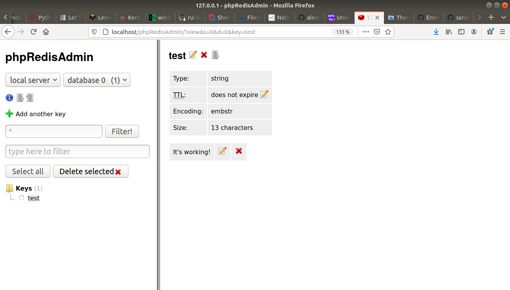

# Installation de Redis sur Ubuntu et interaction avec PHP

```
sudo apt install redis-server
```

Redis est dores et déjà opérationnel à ce stade :
```
sudo systemctl status redis-server
● redis-server.service - Advanced key-value store
   Loaded: loaded (/lib/systemd/system/redis-server.service; enabled; vendor preset: enabled)
   Active: active (running) since Sun 2020-09-20 18:27:24 CEST; 21s ago
     Docs: http://redis.io/documentation,
           man:redis-server(1)
 Main PID: 6881 (redis-server)
    Tasks: 4 (limit: 4915)
   CGroup: /system.slice/redis-server.service
           └─6881 /usr/bin/redis-server 127.0.0.1:6379

sept. 20 18:27:24 alexandrecuer-PORTEGE-R30-A systemd[1]: Starting Advanced key-value store...
sept. 20 18:27:24 alexandrecuer-PORTEGE-R30-A systemd[1]: redis-server.service: Can't open PID file /var/run/redis/redis-server.pid (yet?) a
sept. 20 18:27:24 alexandrecuer-PORTEGE-R30-A systemd[1]: Started Advanced key-value store.
```
Pour vérifier, on peut lancer la ligne de commande :
```
redis-cli
127.0.0.1:6379> ping
PONG
127.0.0.1:6379> set test "It's working!"
OK
127.0.0.1:6379> get test
"It's working!"
127.0.0.1:6379> exit
```
Sur Ubuntu, php est déjà préinstallé
```
sudo apt-get install -y php
Lecture des listes de paquets... Fait
Construction de l'arbre des dépendances       
Lecture des informations d'état... Fait
php est déjà la version la plus récente (1:7.2+60ubuntu1).
0 mis à jour, 0 nouvellement installés, 0 à enlever et 0 non mis à jour.
```
ou encore:
```
php --version
PHP 7.2.24-0ubuntu0.18.04.6 (cli) (built: May 26 2020 13:09:11) ( NTS )
Copyright (c) 1997-2018 The PHP Group
Zend Engine v3.2.0, Copyright (c) 1998-2018 Zend Technologies
    with Zend OPcache v7.2.24-0ubuntu0.18.04.6, Copyright (c) 1999-2018, by Zend Technologies
```
On installe les extensions PHP, puis le module redis pour PHP via pecl :
```
sudo apt-get install -y php-gd php-curl php-pear php-dev php-common php-mbstring
sudo pecl channel-update pecl.php.net
sudo pecl install redis
```
On active le module redis :
```
sudo nano /etc/php/7.2/mods-available/redis.ini
extension=redis.so

sudo phpenmod redis
```

On installe phpRedisAdmin pour voir si tout fonctionne correctement
```
cd /var/www
sudo git clone https://github.com/ErikDubbelboer/phpRedisAdmin.git
cd phpRedisAdmin/
sudo git clone https://github.com/nrk/predis.git vendor
cd /var/www/html
sudo ln -s /var/www/phpRedisAdmin
sudo nano /etc/apache2/sites-available/phpRedisAdmin.conf
<VirtualHost *:80>
    ServerName localhost/phpRedisAdmin
    ServerAdmin webmaster@localhost
    DocumentRoot /var/www/phpRedisAdmin

    # Virtual Host specific error log
    ErrorLog /var/log/phpRedisAdmin/apache2-error.log
    # Access log disabled
    # CustomLog /var/log/phpRedisAdmin/apache2-access.log combined
</VirtualHost>

sudo a2ensite phpRedisAdmin
sudo mkdir /var/log/phpRedisAdmin
sudo systemctl restart apache2
```

to secure redis :

https://www.digitalocean.com/community/tutorials/how-to-install-and-secure-redis-on-ubuntu-18-04
